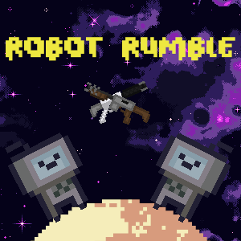

    <picture>
        
    </picture>

<h1 align="center" style="margin-top: 0px;">Choc Cosmique</h1>

Winner of the 2023 Game Jam of the IUT2 de Grenoble (BUT3)

# Context

This game was made for a Game Jam organized in september of 2023 by the IUT2 of Grenoble for the BUT3 students. The 78 students were divided in 20 groups of 3-4. 

The theme was:

*Il était une fois un robot...*

*Maitre de la gravité.*

This Jam duration was 96 hours (from monday to thursday).

# Presentation

Our game is a multiplayer game, kind of like Smash Bros, but in space. You spawn in a randomly generated solar system made of miniature planets (compared to your robot size). The gravity here is *realistic* ([here](https://github.com/GaspardCulis/robot-rumble/blob/main/src/core/gravity.py#L3) is our gravitational constant), you are attracted by the closest and most massive planets. You are given 3 weapons:

- The minigun, fires a burst of bullets (classical minigun behavior)
- The shotgun, fires a lot of bullets once (classical too)
- The black hole gun, fires a black hole that has its own very strong gravitational field

Your goal is to eject the other players out into the void by dealing them knockback with your bulllets or to slingshot them into space with a black hole. When you get shot your *percentage* increases. The amount of knockback you take is multiplied by this percentage.

# Controls

- ZQSD, player controls
- Left click, shoot
- Right click, switch weapon

# Gameplay

# Credits

Thanks to David Harrington for [this cute little robot](https://opengameart.org/content/pixel-robot)

Huge hanks to Deep Fold for [this crazy procedural pixel art planet generator](https://deep-fold.itch.io/pixel-planet-generator)

Thanks again to Deep Fold for [this mindblowing procedural pixel art space background generator](https://deep-fold.itch.io/space-background-generator)

Thanks to Wubs for [yet another amazing pixel art procedural gun generator](https://wubs.itch.io/random-pixel-art-gun-generator)

Also thanks to PizzaDude alias Jakob Fischer, the man behind the Geometry Dash font

And finally thanks to [AhuracMusic](https://www.youtube.com/@Ahurac) who for some reason doesn't appear in this project contributors, even if he wrote some code and made all of our game music and SFX.
